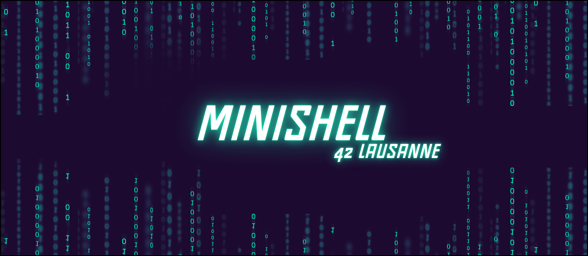

# Minishell
The Minishell project at 42 involves creating a simplified replica of a Unix shell that can interpret and execute commands, handle signals, pipes, redirections, and environment variables.

[![Contributors][contributors-shield]][contributors-url]
[![Forks][forks-shield]][forks-url]
[![Stargazers][stars-shield]][stars-url]
[![Issues][issues-shield]][issues-url]
[![LinkedIn][linkedin-shield]][linkedin-url]

## 📒 Index

- [About](#about)
- [Approach](#approach)
- [Installation](#installation)
- [Development](#development)
  - [Pre-Requisites](#pre-requisites)
  - [File Structure](#file-structure)
 <!-- - [Diagram Architecture](#diagram-architecture)  -->
- [Notes](#notes)
- [Credits](#credits)

## About

**Minishell** is a project done in pairs to familiarize ourselves with working collaboratively. It is well-known for being one of **the first real challenges at 42**, and many developers encounter significant difficulties while working on it. This project is essential for every developer as it teaches crucial skills in the field of development.

**"When you think you’ve finished, that’s just the beginning of the project."**

* *The shell will work only in interactive mode (no scripts, i.e. the executable takes no arguments)*<br>
* *Run simple commands with absolute, relative path (e.g. /bin/ls, ../bin/ls)*<br>
* *Run simple commands without a path (e.g. ls, cat, grep, etc…)*<br>
* *Have a working history (you can navigate through commands with up/down arrows)*<br>
* *Implement pipes (|)*<br>
* *Implement redirections (<, >, >>)*<br>
* *Implement the here-doc (<<)*<br>
* *Handle double quotes ("") and single quotes (''), which should escape special characters, beside $ for double quotes.*<br>
* *Handle environment variables ($ followed by a sequence of characters).*<br>
* *Handle signals like in bash (ctrl + C, ctrl + \, ctrl + D).*<br>
* **Implement the following built-ins:**<br>
	* *echo (option -n only)*<br>
	* *exit*<br>
	* *env (with no options or arguments)*<br>
	* *export (with no options)*<br>
	* *unset (with no options)*<br>
	* *cd*<br>
	* *pwd*<br>

## Approach

This project is quite extensive, with numerous specific cases to consider. The first challenge I encountered was wondering, "*Where do I start?*"<br>

I began Minishell two weeks before **Poid-lourd** could join me. During that time, I worked on the builtins and the initial parsing. Naturally, I had to create an execution base that **Poid-lourd** completely redid at the end of his two weeks. Over time, we quickly defined who should do what and how to do it.<br>

- **Poid-lourd**: Complete execution, redirections (<, <<, >>), and heredoc, which we more or less shared for ease.<br>

- **Me**: Complete parsing, builtins, signals.<br>

We managed error handling and everything else I haven't mentioned together to ensure a solid foundation and consistent logic. We quickly realized that our two real challenges would be parsing and execution due to the numerous specific cases in BASH.<br>

The project is very rewarding and allowed us to develop crucial skills in programming and collaboration. Working in a pair on such a complex project taught us how to communicate well, effectively distribute tasks, and overcome obstacles together.<br>

## Installation
```bash
# Clone this repository
$ git clone https://github.com/HaruSnak/Minishell.git

# Go into the repository
$ cd Minishell

# To compile the program
$ make

# Execution example
$ ./minishell

# Removes all generated files and the executable for a thorough cleanup.
$ make fclean

# Removes generated object files and the executable.
$ make clean
```

## Development
### Pre-Requisites
```
Requirements for Linux

Readline (Install: sudo apt-get install libreadline-dev)
```

### File Structure

```
.
└── 📁minishell-git
    └── Makefile
    └── README.md
    └── 📁includes
        └── .DS_Store
        └── exec.h
        └── 📁libft
            └── Makefile
            └── 📁char
                └── ft_isalnum.c
                └── ft_isalpha.c
                └── ft_isascii.c
                └── ft_isdigit.c
                └── ft_isprint.c
                └── ft_tolower.c
                └── ft_toupper.c
            └── 📁conv
                └── ft_atoi.c
                └── ft_itoa.c
            └── 📁gnl
                └── get_next_line.c
            └── 📁includes
                └── libft.h
            └── 📁lst
                └── ft_lstadd_back_bonus.c
                └── ft_lstadd_front_bonus.c
                └── ft_lstclear_bonus.c
                └── ft_lstdelone_bonus.c
                └── ft_lstiter_bonus.c
                └── ft_lstlast_bonus.c
                └── ft_lstmap_bonus.c
                └── ft_lstnew_bonus.c
                └── ft_lstsize_bonus.c
            └── 📁mem
                └── ft_bzero.c
                └── ft_calloc.c
                └── ft_memchr.c
                └── ft_memcmp.c
                └── ft_memcpy.c
                └── ft_memmove.c
                └── ft_memset.c
            └── 📁printf
                └── ft_conv_primary.c
                └── ft_conv_specifies.c
                └── ft_conv_suit.c
                └── ft_printf.c
            └── 📁put
                └── ft_putchar.c
                └── ft_putchar_fd.c
                └── ft_putendl_fd.c
                └── ft_putnbr.c
                └── ft_putnbr_fd.c
                └── ft_putstr.c
                └── ft_putstr_fd.c
            └── 📁str
                └── ft_split.c
                └── ft_split_tkn.c
                └── ft_strchr.c
                └── ft_strdup.c
                └── ft_striteri.c
                └── ft_strjoin.c
                └── ft_strjoin_fs.c
                └── ft_strlcat.c
                └── ft_strlcpy.c
                └── ft_strlen.c
                └── ft_strmapi.c
                └── ft_strncmp.c
                └── ft_strnstr.c
                └── ft_strrchr.c
                └── ft_strtrim.c
                └── ft_substr.c
        └── minishell.h
    └── 📁srcs
        └── .DS_Store
        └── 📁builtins
            └── built_external.c
            └── builtins_base.c
            └── builtins_utils.c
            └── export_unset_bis.c
            └── export_unset_built.c
            └── out_cd_built.c
            └── out_cd_built_bis.c
        └── 📁errors
            └── errors.c
            └── errors_operators.c
            └── free.c
        └── 📁execution
            └── execution.c
            └── single_execution.c
            └── sub_exec.c
        └── minishell.c
        └── 📁parsing
            └── delete_quote.c
            └── quote.c
            └── redirect_quote.c
            └── token_value.c
            └── var_env.c
            └── var_env_bis.c
            └── verify_operators.c
        └── 📁redirections
            └── here_doc.c
            └── here_doc_bis.c
            └── redirection.c
            └── redirection_utils.c
        └── 📁signals
            └── signals.c
            └── signals_handle.c
            └── signals_heredoc.c
        └── 📁utils
            └── builtins_utils.c
            └── execution_utils.c
            └── execution_utils2.c
            └── execution_utils3.c
            └── free_utils.c
            └── function_utils.c
            └── init_list.c
            └── list_utils.c
            └── single_exec_utils.c
```

<!--### Diagram Architecture
Write the build Instruction here.-->

## Notes
Soon

## Credits

Below you will find the links used for this project:

- [Norm 42](https://cdn.intra.42.fr/pdf/pdf/960/norme.en.pdf)
- [GNU - Bash Reference Manual](https://www.gnu.org/software/bash/manual/bash.html)

[contributors-shield]: https://img.shields.io/github/contributors/HaruSnak/Minishell.svg?style=for-the-badge
[contributors-url]: https://github.com/HaruSnak/Minishell/graphs/contributors
[forks-shield]: https://img.shields.io/github/forks/HaruSnak/Minishell.svg?style=for-the-badge
[forks-url]: https://github.com/HaruSnak/Minishell/network/members
[stars-shield]: https://img.shields.io/github/stars/HaruSnak/Minishell.svg?style=for-the-badge
[stars-url]: https://github.com/HaruSnak/Minishell/stargazers
[issues-shield]: https://img.shields.io/github/issues/HaruSnak/Minishell.svg?style=for-the-badge
[issues-url]: https://github.com/HaruSnak/Minishell/issues
[linkedin-shield]: https://img.shields.io/badge/-LinkedIn-black.svg?style=for-the-badge&logo=linkedin&colorB=555
[linkedin-url]: https://www.linkedin.com/in/shany-moreno-5a863b2aa
